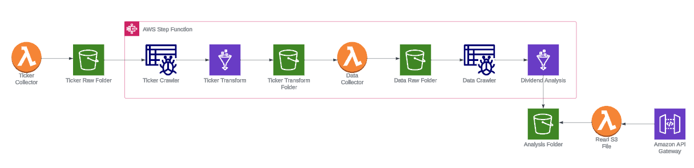
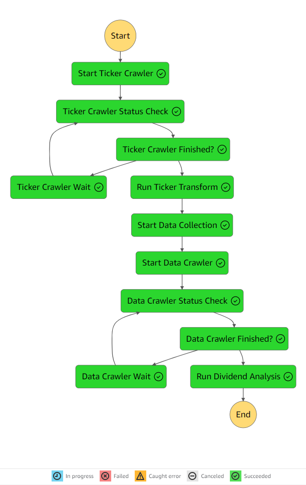

# Dividend Stock Analysis

This project is an ETL data pipeline built with serverless products on AWS. The workflow scrapes the S&P 500 tickers every weekday, extracts price and dividend data for each ticker from yfinance, and transforms the historical data for analysis. The output is served through a REST API to my [portfolio website](https://harrisonlanier.com/portfolio/dividend-analysis) and displays valuation estimates using the Gordon Growth Model. 

---

## Prerequisites 

* An AWS account
* AWS CLI with AWS account configuration
* AWS SAM

## Architecture

## Work Flow

1. AWS Lambda function scrapes S&P 500 tickers and stores as a csv file to the S3 bucket (scheduled to run every weekday).
2. AWS Lambda function starts the step function.
3. AWS Glue Crawler creates the schema of the ticker file.
4. AWS Glue job identifies new and old tickers and stores as a json file to the S3 bucket.
5. AWS Lambda function extracts historical data from yfinance and stores as a csv file to the S3 bucket.
6. AWS Glue Crawler creates the schema of the data file.
7. AWS Glue job transforms and analyzes ticker data for dividend analysis and stores as a json file to the S3 bucket.
8. AWS Lambda function reads the dividend analysis file and serves as a REST API through AWS API Gateway.

## Successful Step Function Execution

## Repository Structure

- template.yml - CloudFormation template file
 - layers - This folder contains python packages needed to create lambda layers
 - glue - This folder contains the following glue jobs
    - ticker_transform.py - Identifies new and old tickers
    - dividend_analysis.py - Analyzes ticker data and creates API output
 - lambda - This folder contains the following lambda functions
    - move_file.py - Moves the source dataset to archive/transform/error folder 
    - check_crawler.py - Checks the status of AWS Glue crawler
    - start_crawler.py - Starts the AWS Glue crawler
    - start_step_function.py - Starts the AWS Step Functions
    - s3_objects.py - Saves the AWS Glue job scripts to S3
    - data_collector.py - Extracts data from yfinance and stores to S3
    - read_s3.py - Reads files from S3
    - ticker_collector.py - Scrapes S&P 500 tickers and stores to S3

## Deploy

This project can be deployed through AWS SAM through the following steps:

1.	Clone the repo
2.	Navigate to the root directory
3.	Execute the following AWS SAM commands
   *sam build --use-container*
   *sam deploy --guided*
4.  Provide the following parameters during deployment - 
    - pS3BucketName - Unique bucket name to store all files
    - pTickerFolder - Folder to store ticker files
    - pDataFolder - Folder to store data files
    - pAnalysisFolder - Folder to store analysis output
    - pRawFolder - Subfolder to store raw datasets
    - pArchiveFolder - Subfolder to store dataset after step function completes
    - pErrorFolder - Subfolder to store dataset after any error
    - pTransformFolder - Subfolder to store transformed dataset
5.	Check the progress of CloudFormation stack deployment in AWS console

## Future Improvements

- Store transformed data in AWS RDS to avoid crawling over all files for every execution.
- Move files to error/archive after the data has been crawled and stored in AWS RDS.
- Optimize dividend analysis AWS Glue job to minimize processing time.
- Store metadata table to avoid calculating price and dividend metadata for every execution.
- Add glue jobs to perform other analysis with the ticker data and serve through the same API.
